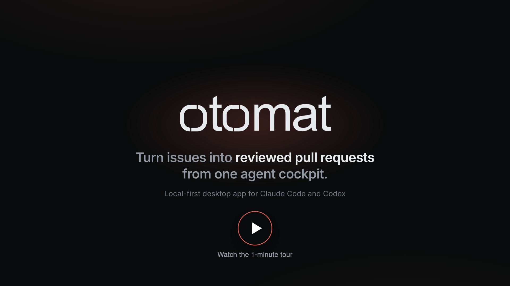

# Otomat

**Turn issues into reviewed pull requests from one agent cockpit.**

  

Otomat is a local-first desktop app for running coding agents on real issues. Pick an issue,
choose an agent, and Claude Code or Codex works on it in an isolated git worktree. Follow the run
live, answer its questions, review the actual diff, send your comments back to the agent, and open
the pull request — from one window, on machines you control, instead of stitching terminals,
worktrees and browser tabs together.

**[Documentation](https://otomat-docs.pages.dev)** ·
**[Download for macOS](https://github.com/alimtunc/otomat/releases)**

## What it does

### Issue-first

A Linear issue or a local one is the durable context of every run, step and pull request. Linear
issues are mirrored with their images, videos and relations, and a merge is written back to the
tracker. While its work is unmerged, an issue owns one branch and one worktree: new work joins it
as a follow-up step, after a step or in parallel, and Otomat compares the workspace with its remote
first, offering to fast-forward, rebase or merge it.

### Single runs and workflows

One agent on one task, or several steps with dependencies, competing candidates and saved presets.
An agent is a profile you define — a runtime, a model, permissions, instructions and the skills it
may activate — frozen into the run at launch. A compete group runs several candidates on the same
objective; you compare their diffs and **Mark as winner** the one the plan continues from. A run
waits for a free session slot, and for a provider quota to reset, on its own.

### Steer the run

Follow the conversation live and message a running agent, images included. Answer its permission
requests and questions, change the model or effort for its next turn, stop, cancel, resume and
recover. **Inbox**, **Conversations**, the Activity Center and desktop notifications show what
waits on you across every project.

### Review the real diff

A run ends on a git diff, not on an agent's summary. Read it by branch, step, commit or pull
request, keyboard-first; mark files reviewed; comment lines or suggest changes. Send the comments
to an agent as a fix step, and each one then shows the hunk that addressed it. The **Files** and
**Changes** tabs let you edit, stage and commit the worktree yourself.

### Ship deliberately

**Generate PR** writes a Conventional Commit subject and a description, then commits, pushes and
opens the pull request in one durable operation; **Customize PR** lets you edit both first. Push
follow-up commits, follow GitHub stacks, and read a completion report built from the run's recorded
evidence. **Reviews** is a pull-request inbox for the connected GitHub account, with review and
merge.

### Local or remote execution

The daemon runs on your Mac or on a Linux server you own, reached over SSH; the app stays the
control plane. Local runs can keep working in the background when you close the window, and runs
on a server never depend on the app. The integrated terminal opens a shell, Claude Code or Codex in
an issue's worktree, locally or on the server, and keeps its recent output.

## Status

Alpha. **macOS on Apple Silicon** only. The agent runtimes are the Claude Code and Codex CLIs you
already have; Otomat ships no model, no built-in agent and no telemetry.

## Install

Download the latest `.dmg` from the [releases page](https://github.com/alimtunc/otomat/releases),
drag **Otomat** to Applications and launch it. The release build is signed and notarized; Otomat
checks for updates itself and never installs one without asking.

You need `git`, the GitHub CLI (`gh auth login`) and at least one of `claude` / `codex` on your
login shell's `PATH`. Details: [Install](https://otomat-docs.pages.dev/guide/install) ·
[Prerequisites](https://otomat-docs.pages.dev/guide/prerequisites).

## Quick start

1. **Add project** from the project switcher and point it at a local git clone.
2. Create an agent under _Settings → Global · Local → Agents_: a runtime, a model, permissions.
3. Open an issue — **New issue**, or one mirrored from Linear — and **Launch run**, as a **Single
   run** or a **Workflow**.
4. Follow the **Conversation** and answer the agent, then read the **Diff** and comment it.
5. **Generate PR**, or **Customize PR** and **Create PR**.

The [guide](https://otomat-docs.pages.dev/guide/introduction) walks through each of these and the
rest of the product.

## Contributing

Otomat is a TypeScript monorepo built with pnpm. Read [`AGENTS.md`](AGENTS.md) — the contributor
and agent guide — and the
[contributing page](https://otomat-docs.pages.dev/guide/contributing), which points to the
architecture references under [`docs/`](docs/ai/codebase-map.md).

## Security

Otomat's security model and how to report a vulnerability:
[Data, privacy and security](https://otomat-docs.pages.dev/guide/data-and-security).

## License

Otomat has not published a license yet; the choice is pending and will land in this repository
as a `LICENSE` file.
