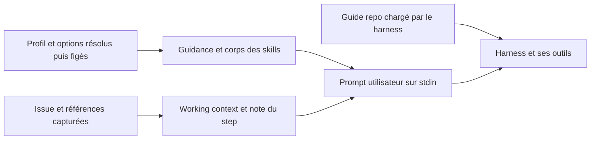

# OTO-177 — Convergence des instructions Claude et Codex/Astra

Audit du **8 septembre 2026**, sur `9050eb5ee97f2a1839ec215bd0a6c98af3d9ac89`,
branche `otomat/run/068e0070`. Le worktree était propre à sa relecture initiale.
Périmètre livré : documentation, recherche et propositions. Aucun changement
applicatif, règle, skill, profil, permission ou état tracker n'est appliqué.

Ce périmètre décrit la phase d'audit. La demande ultérieure « ok fix tout ça »
et ses changements sont suivis dans le
[registre de mise en œuvre](oto-177-implementation.md), qui distingue le diff
appliqué des installations encore bloquées. Les constats ci-dessous gardent
leur date, leurs chemins et leur base d'observation.

La base commune existe déjà : `AGENTS.md` est canonique, `CLAUDE.md` l'importe,
et les skills projet partagent leur corps par liens symboliques. La convergence
doit corriger la découverte, les profils et les contrats de workflow autour de
cette base. Ajouter un second guide « Astra » reproduisant les règles créerait
une nouvelle source de divergence.

Les priorités sont le profil Codex automatique trop permissif, l'opposition
tracker/contexte Otomat, les ressources de skills injectées sans leur origine,
puis les différences de découverte et de vérification. Aucun gain de qualité
sur Astra n'est démontré par cet audit.

## Preuves et limites

- **L — observation locale** : fichiers, code, versions, aide CLI et lectures
  SQLite en `mode=ro` avec `PRAGMA query_only=ON`. La lecture des données se limite
  aux configurations de profils et à la configuration du run courant ; aucun
  corps d'issue supplémentaire, secret, historique utilisateur ou backup exporté.
- **D — fait documenté** : source officielle consultée le **2026-09-08**, citée
  près du fait. Ces pages évoluent ; elles ne prouvent pas le comportement d'un
  binaire ancien ni l'accès d'un compte.
- **H — hypothèse/proposition** : conséquence attendue, à tester avec le
  [protocole comparatif](oto-177-comparison-protocol.md).
- **M — mesure** : uniquement inventaire statique et résultats de commandes
  explicitement rapportés. Les pilotes historiques sont distingués ci-dessous.

Les sept corps de skills projet ont été lus, avec les workflows utilisateur
qui gouvernent les profils présents : `ticket`, `goal-review`, `diagnosing-bugs`,
et les parcours `goal-loop`, `handoff`, `ship`, `pre-pr-review`, `prototype`,
`research`. Les références de ticket utilisées pour plan/handoff/worktree ont
été inspectées. Le catalogue global a été inventorié ; ses 70 corps ne sont pas
tous actifs ni tous audités. Les plugins annoncés, mémoires automatiques, règles
de compte et réglages d'autres hôtes ne sont pas intégralement accessibles ici.
Leur absence de l'audit ne signifie pas leur absence du contexte.

Dans cette session, le guide fourni contient le pointeur RTK utilisateur et le
corps du guide repo ; le catalogue des skills est visible et `research`/
`openai-docs` ont été ouverts pour cet audit. C'est une observation de cette
session, distincte d'un test de chargement natif. Aucune nouvelle session Claude
n'a été lancée pour reconstituer son prompt : sa chaîne est établie par les
fichiers accessibles, les arguments de l'adaptateur et les sources officielles,
avec cette limite explicite.

## 1. Chargement et priorité effectifs

### Ne pas confondre quatre objets

| Objet | Exemple observé | Ce qu'il détermine |
| --- | --- | --- |
| Modèle | ID demandé `gpt-6-astra`, ou alias Claude `opus` | Génération et capacités annoncées ; un nom n'accorde aucun outil |
| Harness | Codex CLI, Claude Code, interface de cette session | Découverte, outils, compaction, transport et application des permissions |
| Profil Otomat | `Ticket (auto)` | Runtime, modèle/options, guidance et skills sélectionnés, figés au lancement |
| Hôte | VPS, binaires installés, configuration personnelle, sandbox | Ce qui est disponible, autorisé et réellement exécutable |

Un profil Otomat n'est ni un profil CLI Codex ni un sous-agent Claude.
`workflow.token_budget: normal` dans `.turkit.yaml` règle le workflow Turkit ;
ce n'est pas `reasoning_effort`, une fenêtre de contexte ou un plafond facturé.

### Entrées natives

| Surface | État local et portée | Priorité / découverte |
| --- | --- | --- |
| Codex, règles utilisateur | `~/.codex/AGENTS.md` contient seulement `@/home/ubuntu/.codex/RTK.md` | Le mécanisme documenté choisit `AGENTS.override.md`, sinon `AGENTS.md` ; l'expansion automatique de `@…` n'est pas établie par cette documentation |
| Codex, règles repo | Racine `AGENTS.md`, 309 lignes / 17 447 octets ; aucun fichier imbriqué ou override trouvé | Chaîne racine → CWD, un fichier par niveau ; le plus proche prime. Plafond combiné documenté : 32 KiB par défaut |
| Claude, règles utilisateur | `~/.claude/CLAUDE.md` : identité Git à préserver, absence d'attribution agent, import `@RTK.md` | Chargement natif Claude ; détails de hiérarchie dans l'annexe |
| Claude, règles repo | `CLAUDE.md` : 6 lignes, `@AGENTS.md` ; pas de règles imbriquées, de `CLAUDE.local.md` ou de `.claude/rules` trouvés dans le checkout | L'import donne accès au même guide ; pas une seconde copie métier |
| Codex, skills repo | Sept dossiers `.agents/skills` ; deux `agents/openai.yaml` | Métadonnées puis corps à l'activation ; deux skills homonymes ne sont pas fusionnés |
| Claude, skills repo | Six `.claude/skills/*` symlinkés vers `.agents/skills/*` ; `update-atlas` absent | Découverte native via ces liens ; une collision personnelle peut masquer le skill projet |
| Commandes repo | Aucune `.claude/commands`, aucun fichier de configuration `.codex` versionné | Turkit est installé sur l'hôte ; sa disponibilité ne vient pas du clone |

`.turkit.yaml` pointe vers `AGENTS.md`, `pnpm check` et `pnpm guard:react`, avec
une review stricte et les commentaires limités aux raisons non évidentes.
Ni `~/.config/turkit/config.yaml` ni `~/.turkit.yaml` n'est présent sur cet hôte.
Le chargement de cette configuration dépend de l'activation d'un workflow
Turkit ; un lancement brut de modèle ne la transforme pas en réglages du CLI.

Pour Codex, ces règles de découverte sont documentées dans
[AGENTS.md](https://learn.chatgpt.com/docs/agent-configuration/agents-md) et
[Skills](https://learn.chatgpt.com/docs/build-skills). Ici, le texte RTK a été
ouvert explicitement ; ce fait ne prouve pas un import natif Codex. Les faits
Claude et leurs limites sont sourcés dans
[l'annexe Anthropic](oto-177-claude-sources.md#instructions-de-dépôt).

Les réglages Codex suivent CLI/`-c` → projet approuvé → profil CLI → utilisateur
→ système → défauts, sous contraintes gérées. Ils ne changent pas la priorité
des instructions métier. [Configuration officielle](https://learn.chatgpt.com/docs/config-file/config-basic).
Les fichiers standards `/etc/codex/{requirements,managed_config,config}.toml`
et `/etc/claude-code/{CLAUDE.md,managed-settings.json}` sont absents ici ; les
politiques gérées par un compte restent une inconnue.

### Ce qu'Otomat ajoute

Le chemin lu dans le code est :

| Étape | Preuve locale | Contrat constaté |
| --- | --- | --- |
| Résolution | [agents/resolve.ts](../../../apps/local-daemon/src/agents/resolve.ts), [execution/levels.ts](../../../packages/domain/src/execution/levels.ts) | Overrides step/lancement, profil, défauts hôte compatibles, puis défaut fournisseur ; provenance et hash conservés |
| Catalogue | [skills/roots.ts](../../../apps/local-daemon/src/agents/skills/roots.ts), [discovery.ts](../../../apps/local-daemon/src/agents/skills/discovery.ts) | Utilisateur : seulement `~/.claude/skills`. Projets enregistrés : `.agents/skills`, puis `.claude/skills`, dans `project.root_path`. Déduplication par `realpath`, premier chemin gagnant |
| Gel du skill | [skills/resolve.ts](../../../apps/local-daemon/src/agents/skills/resolve.ts) | Fichier relu depuis le catalogue, contenu/hash figés ; limite de 64 000 caractères par skill. Un profil global ne peut pas sélectionner un skill projet |
| Construction | [agents/prompt.ts](../../../apps/local-daemon/src/agents/prompt.ts) | Préfixe intitulé `System guidance`, puis noms et corps complets des skills, puis contexte. Le titre ne crée pas un message système ; chemins d'origine et fichiers annexes ne sont pas inclus dans le rendu |
| Contexte | [context/freeze.ts](../../../apps/local-daemon/src/context/freeze.ts), [files.ts](../../../apps/local-daemon/src/context/files.ts), [render.ts](../../../apps/local-daemon/src/context/render.ts) | Références déclaratives figées ; fichiers lus dans un snapshot Git commun, symlinks refusés ; note placée en dernier ; consigne explicite de ne pas appeler le tracker |
| Transport | [Claude adapter](../../../apps/local-daemon/src/runtime/providers/claude/adapter.ts), [Codex adapter](../../../apps/local-daemon/src/runtime/providers/codex/adapter.ts) | Claude `-p --input-format stream-json` reçoit une frame utilisateur ; Codex `exec --json … -` reçoit stdin. Leurs contextes natifs restent différents |
| Reprise | [supervisor/worker.ts](../../../apps/local-daemon/src/supervisor/worker.ts), lignes 75–100 | Session existante : prompt brut, sans recomposer guidance/skills. Session fraîche : composition. La persistance de chaque référence après compaction n'est pas testée par ce seul code |

Le parser [frontmatter.ts](../../../apps/local-daemon/src/agents/skills/frontmatter.ts)
ne retourne que nom et description. Injecter le YAML `allowed-tools` ou
`disable-model-invocation` comme texte ne met pas en œuvre sa sémantique native.
Les tests [prompt.test.ts](../../../apps/local-daemon/tests/agents/prompt.test.ts)
et [steering-parity.test.ts](../../../apps/local-daemon/tests/runtime/steering-parity.test.ts)
protègent des contrats de composition/transport, pas une égalité de contexte
ni le respect des règles par les modèles.

### Outils, autonomie et permissions

Otomat annonce pour Claude questions et permissions sur le canal stdio ainsi que
steering en cours de tour. Pour Codex, l'adaptateur annonce des interactions
non supportées et du steering à la frontière des tours. Un workflow qui impose
`AskUserQuestion`, `Task` ou `Workflow` exige donc une adaptation par capacité.
Les branches de repli séquentiel de `ticket` et `goal-review` sont déjà utiles.
`research`, lui, exige un agent de recherche sans décrire de repli.

Le mode non interactif officiel utilise `codex exec`, avec un flux JSONL possible.
[Documentation](https://learn.chatgpt.com/docs/non-interactive-mode).
La contrainte précise de question/réponse ci-dessus vient de l'adaptateur et des
preuves de version locales, pas d'une incapacité d'Astra.

Le [diagnostic permissions existant](../codex-permissions.md) documente déjà
`workspace-write` comme défaut Otomat et les différences de reprise CLI.
L'absence de question interactive n'autorise pas une action interdite ; une
ambiguïté réellement bloquante doit être rapportée pour un tour ultérieur.

## 2. Inventaire de l'hôte et identité des modèles

Commandes de lecture utilisées : `codex --version`, `claude --version`,
`codex debug models --bundled`, `claude --help`, sous `rtk proxy`.

| Signal local | Valeur observée | Limite |
| --- | --- | --- |
| Binaires | Codex `0.153.4` ; Claude Code `2.1.263` ; RTK `0.45.0` | Version de l'hôte, pas verrouillée par le repo |
| Configuration personnelle Codex | `gpt-5.6-sol`, effort `high` | Ne décrit pas le run courant, qui a un override |
| Configuration personnelle Claude | `fable[1m]`, effort `xhigh` | Alias configurable ; aucune nouvelle inférence Claude effectuée |
| Run courant, plan et session figés | `gpt-6-astra`, source `discovered`, effort `xhigh`, sandbox `workspace-write`, aucun profil/guidance/skill sélectionné | Modèle demandé ; `reported_model` et ID de session fournisseur absents à la lecture, donc aucune identité serveur supplémentaire attestée |
| Catalogue Codex embarqué pour Astra | `low`, `medium`, `high`, `xhigh`, `max`, `ultra` ; défaut annoncé `low` ; contexte `272000` | Offre du CLI, pas facture ni garantie d'accès. La config personnelle peut remplacer ce défaut |
| Catalogue Otomat Claude | Aliases `opus`, `sonnet`, `fable`, IDs personnalisés acceptés | [models.ts](../../../apps/local-daemon/src/runtime/providers/claude/models.ts) ne résout pas le modèle serveur |

**D :** OpenAI documente l'ID `gpt-6-astra`, les efforts API `low` à `max`,
une fenêtre de 1 050 000 tokens et 128 000 tokens de sortie. La fiche annonce
10 $/MTok d'entrée hors cache et 50 $/MTok de sortie en standard, avec
majoration au-delà de 272K d'entrée par requête.
[Fiche officielle Astra](https://developers.openai.com/api/docs/models/gpt-6-astra).
**L/H :** `ultra` apparaît seulement dans la preuve CLI consultée, décrit comme
raisonnement maximal avec délégation automatique. Ni sa fenêtre locale ni cette
orchestration ne doivent être transformées en contrat API par analogie de nom.
L'audit ne change pas l'effort de la session courante.

L'[annexe Claude](oto-177-claude-sources.md#modèle-version-et-effort) confronte
les alias/efforts locaux aux IDs et versions officiels. Elle ne prétend pas
qu'un profil `opus` a effectivement tourné avec le dernier modèle publié.

### Profils accessibles, sans modification

Lecture locale de `~/.otomat/local/data/otomat.db`, table `agent_profiles` ; six
profils, tous globaux. Les noms sont des libellés utilisateur, pas des rôles
créés par Otomat.

| Runtime / profil | Modèle et options stockés | Instructions sélectionnées |
| --- | --- | --- |
| Claude / Reviewer | `opus`, `auto`, `xhigh` | `goal-review`, guidance de correction stricte |
| Claude / Ticket (auto) | Modèle et options hérités | `ticket --auto`, sans reviewer ni publication |
| Claude / Debugger | Hérités | `diagnosing-bugs`, correction et test de régression |
| Codex / Ticket (plan) | Sol, `xhigh`, `workspace-write` | `ticket --plan`, arrêt avant implémentation |
| Codex / Ticket (execute) | Sol, `xhigh`, `workspace-write` | `ticket --execute`, plan validé requis |
| Codex / Ticket (auto) | Sol, `xhigh`, `danger-full-access` | `ticket --auto`, deux blocs répétés ; aucune publication autorisée |

Les 70 skills de `~/.claude/skills` pointent vers les 70 copies de
`~/.agents/skills`. Les 13 skills directs sous `~/.codex/skills` constituent une
autre surface installée, sans compter `.system` et les plugins. Le catalogue de
cette session montre notamment des noms Cloudflare répétés et deux `prototype`.
La duplication de noms est observée ; le chargement de tous leurs corps ne l'est pas.

## 3. Audit priorisé

P1 : peut bloquer un premier passage ou changer son cadre. P2 : cohérence,
contexte et maintenabilité. Ces priorités évaluent des risques documentés, pas
une fréquence de panne mesurée.

| ID | Priorité / preuve | Constat et conséquence | Action proposée |
| --- | --- | --- | --- |
| F1 | P1, L — profil Codex `Ticket (auto)` | `danger-full-access` stocké ; la guidance affirme que ce mode ne fait que supprimer les questions. C'est faux : le confinement et l'approbation sont indépendants. Les paragraphes d'invocation et de périmètre sont chacun répétés. La prose de périmètre ne restaure pas le sandbox | Remplacer le réglage pour les prochains lancements validés par `workspace-write`, éliminer la répétition, expliquer les deux axes ; conserver les sessions figées et l'historique |
| F2 | P1, L — `AGENTS.md:302`, `context/render.ts:72`, `ticket/SKILL.md:54` | Le guide ordonne un passage tracker à In Progress ; le contexte Otomat interdit tout appel tracker. Le ticket utilisateur présent réaffirme cette interdiction, donc aucun appel ici | Donner une exception explicite au contexte attaché, garder le parcours tracker pour une session indépendante autorisée |
| F3 | P1, L — `skills/roots.ts:17–35`, `skills/discovery.ts` | Catalogue utilisateur lié à `.claude` ; les installations exclusivement `.agents`/Codex disparaissent du picker Otomat. Sur ce VPS les liens masquent ce défaut. Les racines projet sont le checkout enregistré, pas nécessairement le worktree du run | Découvrir `.agents/skills` comme racine commune, compatibilité `.claude`, provenance explicite ; tester un skill modifié seulement dans un worktree |
| F4 | P1, L/H — `agents/prompt.ts:15–21`, `skills/resolve.ts:34`, `frontmatter.ts` | Le gel conserve le corps mais le rendu perd `canonical_path`. `references/plan-template.md` dans `ticket`, ou `AUDIT.md` dans un skill de motion, ne possède plus d'origine explicite. Frontmatter/outils et ressources annexes ne sont pas exécutés/figés par cette injection | Rendre l'origine consultable ; distinguer instructions textuelles et métadonnées natives ; définir quelles références restent vivantes et lesquelles sont figées. Ne pas créer un moteur générique de skills |
| F5 | P1, L/H — profils globaux + `requireSkillInScope`, `AGENTS.md:145`, `first-pass-quality/SKILL.md` | Aucun profil présent n'active `first-pass-quality`. Sa disponibilité implicite est possible, pas une preuve d'activation. Un profil global ne peut pas sélectionner ce skill projet | Profils de projet explicitement choisis ou invocation explicite du chemin ; garder le diff pass dans le guide pour les sessions sans profil |
| F6 | P1, L/D — deux `prototype/SKILL.md` | Le skill personnel autorise son déclenchement implicite, préconise peu de vérification et demande un commit de capture ; celui du repo exige une invocation explicite et un picker poli. Un même nom mène à des intentions différentes selon le harness | Désambiguïser les noms/provenances ; dans l'immédiat nommer le chemin projet, garder l'interdiction de commit sans demande utilisateur |
| F7 | P2, L — `.claude/skills`, README des skills | Six liens valides pour sept skills ; `update-atlas` manque côté Claude natif. Otomat et Codex voient néanmoins sa copie `.agents` | Ajouter l'adaptateur de découverte manquant, sans copier le corps |
| F8 | P2, L — `ticket/SKILL.md:119`, `.turkit.yaml:4`, `first-pass-quality/SKILL.md:18` | `ticket` demande le `check` complet pour « typecheck » chaque critère ; ici ce script lance aussi lint, build, smoke et toutes les suites. Le skill qualité demande encore `react_review` alors que `check:static` l'inclut déjà | Distinguer boucle ciblée et gate final ; ne répéter après succès que si un nouveau diff ou risque le justifie |
| F9 | P2, L — `handoff/SKILL.md:54`, `ticket/references/handoff-format.md`, `ship/SKILL.md:22,35` | Handoff générique interdit une section de reste et pointe vers des commits inexistants avant commit ; template ticket omet checks exacts et commentaires ; `ship` suggère parfois un sujet seul et ferme le tracker. Risque de perdre le footer obligatoire ou les limites | Un contrat de handoff factuel commun, adaptable avant/après commit ; publication et fermeture demandées explicitement, convention repo prioritaire |
| F10 | P2, L — `find-animation-opportunities/SKILL.md:53,79,112,115`, `prototype/SKILL.md:8` | Exemples `height + opacity` et toast 400 ms contredisent « transform/opacity only » et <300 ms ; `pick-ui-library` cité mais absent du catalogue inspecté. `improve-animations` interdit les mutations puis propose `execute` dans un worktree | Garder le vendor épinglé ; correction upstream ou adaptation locale documentée, sans traiter ses exemples comme exceptions au repo |
| F11 | P2, L — guide, docs qualité, RTK globaux | Guide de 309 lignes avec commande/build/ownership répétés ; doc qualité dit React Doctor `0.9.12` dans l'état d'adoption, package actuel `0.9.13`. RTK Claude promet une réécriture par hook, alors que le settings lu ne déclare aucun hook RTK. La règle globale d'identité Git n'existe que côté Claude | Pointer vers propriétaires exécutables, conserver les chiffres historiques datés ; vérifier le hook réel sans supposer son installation ; décider si l'identité est une exigence d'équipe ou une préférence personnelle |
| F12 | P1 pour l'évaluation, L — `codex/frames.ts:47–62`, doc qualité historique | Modèle/coût Codex laissés `null`, cache non ventilé dans l'usage normalisé. Une réussite affichée ne prouve pas le modèle effectif, les checks ou la qualité. Le pilote existant n'utilise pas Astra et n'exécute pas ses patches | Registre d'évaluation avec valeurs absentes explicites, données natives ciblées ; pas de classement modèle à partir de cet audit |

Les chemins Turkit abrégés de cette table sont relatifs à
`/home/ubuntu/.agents/skills/` sur l'hôte audité. Ce sont des installations
externes au repo ; les lots qui les concernent doivent être livrés dans leur
source/distribution, pas corrigés clandestinement dans le home.

Le scan des liens Markdown relatifs de `AGENTS.md`, `CLAUDE.md`, des sept skills
projet et des neuf workflows sélectionnés n'a trouvé aucun fichier cible
manquant. Ce contrôle n'analyse ni toutes les ancres ni les références en prose :
`pick-ui-library` reste un renvoi non résolu. Les six symlinks existants sont valides.

Autre preuve d'obsolescence liée à F11 :
[claude/options.ts](../../../apps/local-daemon/src/runtime/providers/claude/options.ts),
lignes 32, 51 et 54, présente encore les questions headless comme impossibles,
alors que l'adaptateur et les tests `claude-interactions.test.ts` exposent le
canal de réponse. Corriger cette description dans L3 ; élargir les permissions
pour compenser ce texte serait la mauvaise conclusion.

## 4. Organisation cible et matrice de décision

**Proposition, non appliquée.** Garder une seule source par catégorie :

- `AGENTS.md` : contrat métier/qualité et règles d'autorité communes ; noms des
  gates et pointeurs vers leurs propriétaires. Une future réduction ne retire
  ni TanStack Form, ni erreurs/stale data, ni isolation, ni invariants de run.
- `CLAUDE.md` : import court du guide et uniquement les adaptations natives
  nécessaires. Aucun `ASTRA.md` avec une copie du guide.
- `.agents/skills` : corps projet communs ; `.claude/skills` : liens fins.
  Ressources adjacentes consultées à la demande. Métadonnées OpenAI gardées à part.
- `.turkit.yaml` : commandes et choix du repo. Turkit partagé et épinglé au niveau
  de sa distribution ; pas de commande Claude qui recopie un workflow entier.
- Profils utilisateur : sélection explicite de runtime/modèle/options et d'une
  procédure commune. Aucun guide métier parallèle en guidance. Même corps pour
  les deux profils de projet lorsque l'intention est la même.
- `docs/ai` et configurations de gates : références propriétaires à consulter
  selon la tâche. Ne pas importer tout le codebase-map au démarrage.

| Élément | Décision | Justification / lot |
| --- | --- | --- |
| Invariants métier, frontières, qualité de `AGENTS.md` | Conserver | Contrat commun ; L1 ne peut ni retirer ni affaiblir ces exigences |
| Séquences et explications répétées dans le guide/doc qualité | Fusionner puis déplacer les détails | Guide → owner concret ; pas de nouvelle copie complète ; L1 |
| `CLAUDE.md @AGENTS.md` | Conserver | Adaptateur déjà minimal ; L1 |
| Corps `first-pass-quality` | Conserver, préciser la répétition de gates | Séquence courte et complémentaire aux checks ; L1/L2 |
| Symlinks `.claude/skills` | Conserver et compléter | Même fichier physique ; L2 |
| `update-atlas` | Conserver | Ajouter seulement sa découverte Claude ; L2 |
| Deux `prototype` | Réécrire l'identité / déplacer le personnel hors collision | Intentions distinctes, fusion sémantique injustifiée ; L2 |
| Skills motion vendored et licence | Conserver le pin ; proposer corrections upstream | Exceptions explicites et exemples cohérents dans un lot validé ; L2 |
| Texte répété des profils auto | Supprimer la duplication | Même invocation déjà présente deux fois ; L0 |
| Guide qualité copié dans Reviewer | Déplacer vers la règle commune / le skill | Profil sélectionne une procédure, ne réécrit pas son barème ; L0/L1 |
| `danger-full-access` comme commodité d'autonomie | Supprimer cette recommandation | Ne protège pas le périmètre ; pas d'augmentation de permissions ; L0 |
| `ticket --auto`, `--plan`, `--execute` | Conserver, adapter les capacités | Modes utiles ; éviter un gate complet par critère et des appels d'outils indisponibles ; L1/L3 |
| Handoff et conventions de publication | Fusionner le contrat, garder publication distincte | Reste, diff non commité, checks exacts, footer et autorité explicites ; L1 |
| RTK et préférences Git personnelles | Déplacer dans l'adaptateur hôte si personnelles | Disponibilité/hook à vérifier ; une préférence d'équipe doit devenir commune ; L0/L1 |
| Règles de lint, baselines, `pnpm check` | Conserver intactes | Réduction de prose et de répétitions, aucune suppression de contrôle |
| Données historiques OTO-128 | Conserver comme historique | Ne pas les réétiqueter preuve Astra ; L4 |

## 5. Usage immédiat, avant les refontes

Pour **Astra**, sélectionner explicitement `gpt-6-astra` dans un lancement
Codex et vérifier les options annoncées par ce binaire. Garder
`workspace-write` ; l'absence de canal interactif impose des critères résolus
avant lancement. Ne pas utiliser le profil auto actuel sans vérifier ses
permissions. Pour une implémentation Otomat, choisir un profil **de projet**
avec `first-pass-quality`, ou demander explicitement le skill par son chemin.
Le run d'audit présent ne nécessite pas ce skill d'implémentation.

Pour **Claude**, conserver l'import du guide et les symlinks ; choisir le même
workflow d'implémentation et la même base. Relever l'ID résolu et l'effort dans
les traces disponibles ; éviter qu'un alias, plugin ou skill personnel change
silencieusement le candidat. `Ticket --plan` reste un mode de planification,
pas une implémentation ratée.

Pour les deux : critères d'acceptation numérotés, fichiers/contrats pertinents,
un exemple existant, une commande de reproduction lorsqu'il y a un bug,
tests ciblés puis `pnpm check`, diff pass et preuves dans le handoff. Ne pas
attacher une guidance déjà sélectionnée comme fichier ni copier le corps de
l'issue dans une note. Les références restent déclaratives.

**Effort proposé, à mesurer :** garder le niveau effectif connu comme baseline ;
pour une nouvelle configuration sans historique, essayer `medium` sur une tâche
bornée et `high` sur un changement de contrat ambigu, si le modèle les annonce.
Une recommandation Claude propre au modèle peut justifier un autre point de
départ. Comparer ensuite un cran plus haut seulement sur des échecs de raisonnement
identifiés. Ni `max`, ni `ultra`, ni un prompt plus long ne sont le défaut conseillé.

OpenAI décrit Astra comme plus sensible aux instructions et aux pauses de
clarification ; son guide conseille d'auditer les skills, de préciser
l'autonomie et de proportionner la vérification. C'est une recommandation de
l'éditeur, pas un résultat local.
[Guide Astra](https://developers.openai.com/api/docs/guides/latest-model).
La [synthèse Claude](oto-177-claude-sources.md#contexte-et-vérification) converge
sur critères vérifiables et contexte ciblé. Les noms d'effort ne sont pas une
échelle commune entre fournisseurs.

## 6. Lots exécutables proposés

Ces lots requièrent une validation ultérieure de leur périmètre. Ils ne sont pas
des changements effectués par cet audit. Chacun conserve le gate complet et
le diff pass obligatoire ; toute modification de règles/skills applique alors
les workflows de rédaction de règles du repo.

| Lot / dépendances | Périmètre et étapes | Acceptation et validation |
| --- | --- | --- |
| **L0 — choix d'hôte et profils**, autonome | Dans les réglages/profils gérés par le daemon, relever avant/après, corriger le texte répété de Codex auto, distinguer sandbox et approval, proposer des profils de projet de même intention. Ne jamais écrire directement SQLite ni réviser un plan lancé | Nouveaux lancements explicitement confinés ; profils historiques conservés ; ID/options/provenance visibles ; lecture d'une configuration résolue suffisante, aucun run payé obligatoire. Vérifier que le skill projet est sélectionnable et que l'ancien cycle reste inchangé |
| **L1 — contrat commun de workflow**, autonome | `AGENTS.md`, `CLAUDE.md`, doc qualité et source Turkit `ticket`/handoff/ship : résoudre F2/F8/F9/F11. Réduire les répétitions, garder les références versionnées et la règle de publication explicite | Une matrice avant/après rattache chaque exigence actuelle à un owner ; cas contexte attaché sans tracker, implémentation autorisée sans pause de routine, vrai blocage, `--plan`, diff non commité, publication non demandée. Tests de règles statiques + `pnpm check`. Aucun nouveau skip, baseline ou permission |
| **L2 — découverte et provenance des skills**, L1 pour les noms | `skills/{roots,discovery,resolve}.ts`, `.agents/skills/README.md`, adaptateurs Claude et distribution personnelle : couvrir `.agents` utilisateur, alias compatibles, lien atlas et collision prototype ; traiter les anomalies vendor sans mise à jour aveugle | Fixtures home/project/worktree/remote distincts ; même `realpath` dédupliqué, homonymes distincts affichés avec origine ; aucun skill d'un autre projet activable ; liens valides. Tests agents/skills DB, typecheck et gate complet |
| **L3 — injection et capacités**, L2 | `agents/prompt.ts`, contrat de skill et tests runtime/context : rendre les références relatives résolubles depuis leur propriétaire, documenter corps figé/annexes vivantes ; neutraliser les attentes de frontmatter non prises en charge ; expliciter les replis outils | Fixture d'un skill avec `references/…` hors CWD ; test initial/reprise et ressource absente, sans modèle. Aucun titre transformé en directive privilégiée ; aucun fs de worktree/symlink ajouté aux prompts ; adaptateurs Claude/Codex reçoivent la même intention et refusent les actions non autorisées |
| **L4 — protocole et pilote**, L0–L3 pour tester la cible | Préparer les trois tâches, les clones de test, le registre et l'enveloppe du [protocole](oto-177-comparison-protocol.md). Résoudre avant campagne la contrainte React Doctor. Faire approuver candidats, coûts et plafonds | D'abord contrôles sans modèle ; puis seulement essais explicitement autorisés. Rapport avec effectifs, échecs, inconnues et coût par tâche réussie ; aucune conclusion causale modèle/harness tirée du seul couple Claude Code/Astra-Codex |

L0 améliore l'usage immédiat sans attendre une migration de transport. Un passage
à app-server serait un projet séparé, justifié seulement si l'interactivité est
un besoin produit ; ce n'est pas un prérequis à la qualité du code.

## 7. Mesures disponibles et couverture du ticket

Les tailles ci-dessous incluent le frontmatter, compté avec `split()` pour les
mots. Ce ne sont pas des tokens facturés ni une mesure du contexte réellement lu.

| Fichier / ensemble | Mesure locale |
| --- | --- |
| `AGENTS.md` | 2 495 mots, 17 447 octets, SHA-256 `a6b4ed6c3a6f31ba85bbf51b6b68270f97cd55e7446dca0ce9a0069ef83798be` |
| `first-pass-quality/SKILL.md` | 207 mots, 1 491 octets, 26 lignes |
| `emil-design-eng/SKILL.md` | 3 877 mots, 27 226 octets, 674 lignes ; charger ce corps seulement pour une tâche pertinente |
| Catalogue projet | 7 skills, 6 symlinks Claude valides |
| Comparaison nouvelle | 0 session candidate lancée ; durée/tokens/coût comparatifs : non mesurés |

Le [pilote OTO-128](../first-pass-quality.md#oto-128-pilot-result) est une preuve
historique déclarée, non rejouée : Claude Haiku et Codex Luna, réponses seules,
trois répétitions, effort faible. Il a rejeté un rapport de self-review plus long.
Il n'établit ni performance Astra, ni réussite de patches exécutés, ni avantage
causal de la règle courte. Ses valeurs ne sont pas transposées à ce ticket.

| Critère OTO-177 | Livraison |
| --- | --- |
| Chargement effectif Claude/Codex | §1, limites des règles natives et de l'injection distinguées |
| Biais, lacunes, duplications, contradictions prouvés | F1–F12 et inventaire hôte |
| Sources primaires actuelles et limites | Liens OpenAI ci-dessus, annexe Anthropic datée |
| Source commune sans copies divergentes | §4 et matrice de décision |
| Usage immédiat Astra sans dégrader Claude | §5, L0 et validation symétrique |
| Premier passage défini et comparaison équitable | Protocole séparé, budget et registre reproductibles |
| Gates et permissions préservés | Aucun changement de ces fichiers/réglages ; lots explicitement bornés |
| Lots directement exploitables | L0–L4, chemins, dépendances, acceptation et contrôles |

La validation de cette livraison documentaire et ses éventuels blocages
d'environnement sont consignés dans le
[registre du protocole](oto-177-comparison-protocol.md#résultats-de-cet-audit).
