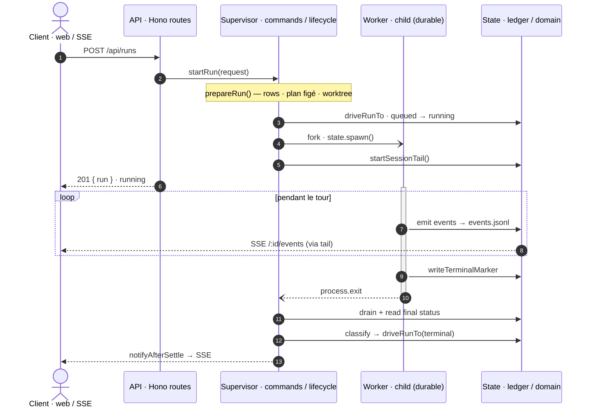
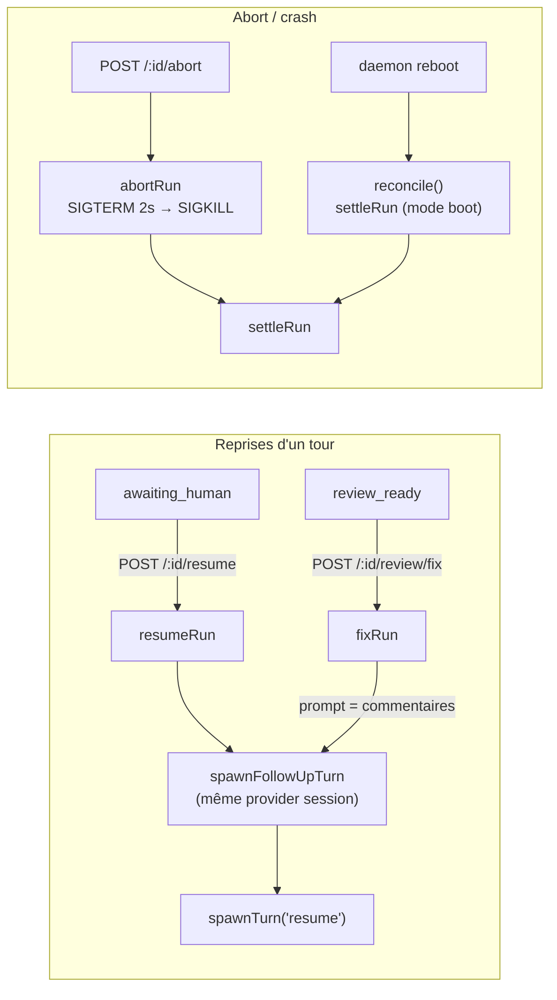
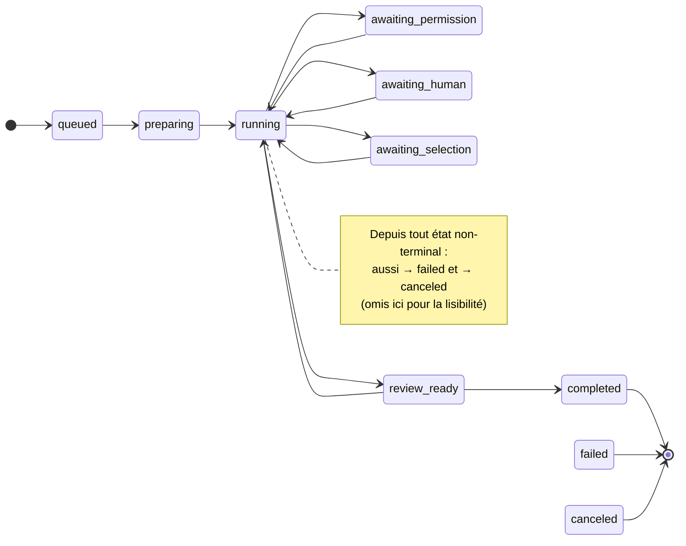

# Cycle de vie d'une run

> **Vue riche** (SVG rendu, couleurs, barres d'activation) :
> [`run-lifecycle-visual-map.html`](run-lifecycle-visual-map.html) — à ouvrir en local
> (GitHub affiche le `.html` en source brute, pas rendu).

Un tour d'agent supervisé. Le parent `fork` un worker enfant — **seul écrivain
durable** — qui écrit dans `events.jsonl` ; le parent *tail* ce ledger et pilote les
state machines du domaine. La vérité de fin de run vient toujours du **ledger**
(terminal marker), jamais d'une supposition du parent.

**Flux nominal :** `POST /api/runs` → `startRun` → `prepareRun` (rows + plan figé +
worktree) → `spawnTurn` (slot + `queued→running` + fork) → worker écrit les events →
`proc.exited` → `settleRun` (classe + drive vers terminal) → `notifyAfterSettle` (SSE).

## Flux nominal — start → settle

## Reprises & abort — greffent sur la même `spawnTurn`

## Domain — `runMachine` (transition illégale → throw)

## Fichiers

| Rôle | Fichier |
| --- | --- |
| Surface HTTP (start · resume · abort · fix · SSE) | [`api/routes/runs.ts`](../../apps/local-daemon/src/api/routes/runs.ts) · [`review.ts`](../../apps/local-daemon/src/api/routes/review.ts) |
| Commandes du supervisor | [`supervisor/commands.ts`](../../apps/local-daemon/src/supervisor/commands.ts) |
| Matérialisation (rows · plan · worktree) | [`supervisor/prepare.ts`](../../apps/local-daemon/src/supervisor/prepare.ts) |
| Exécution (spawn · activation · tail) | [`supervisor/lifecycle.ts`](../../apps/local-daemon/src/supervisor/lifecycle.ts) |
| Worker enfant (durable) | [`supervisor/worker.ts`](../../apps/local-daemon/src/supervisor/worker.ts) |
| Finalisation (live · abort · boot) | [`supervisor/settle.ts`](../../apps/local-daemon/src/supervisor/settle.ts) |
| Traduction machine → DB | [`supervisor/transitions.ts`](../../apps/local-daemon/src/supervisor/transitions.ts) |
| State machine | [`domain/state-machines/run.ts`](../../packages/domain/src/state-machines/run.ts) |
