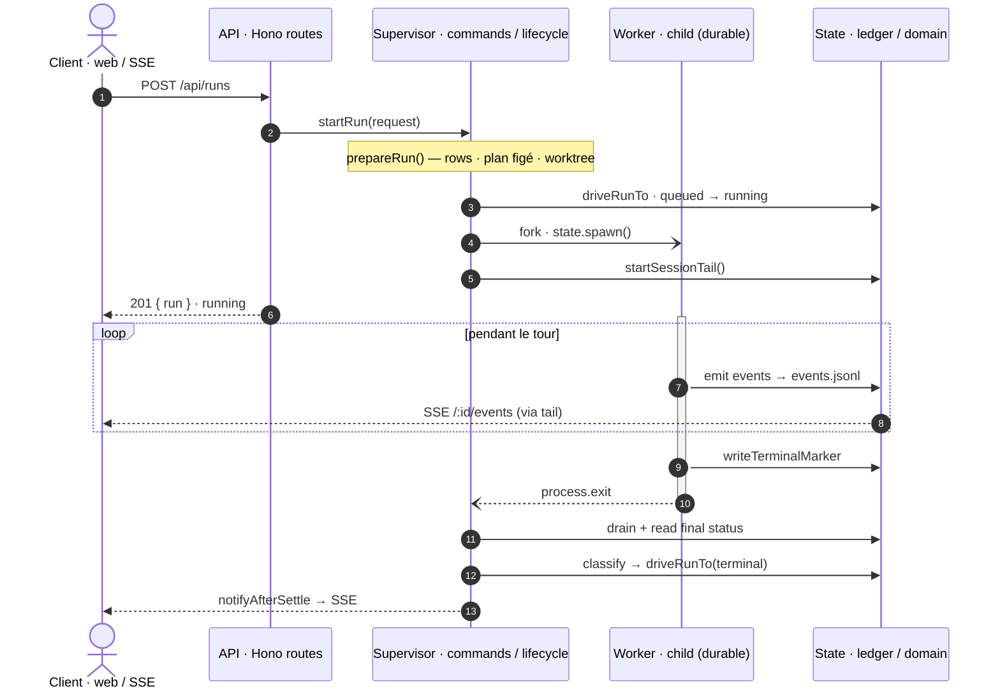
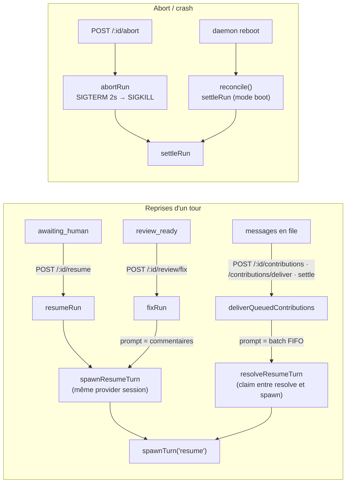
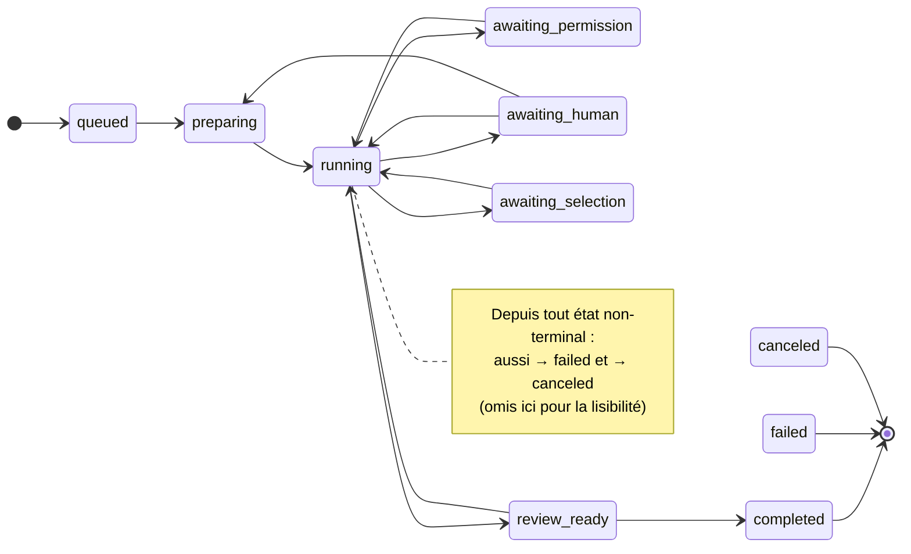

# Cycle de vie d'une run

> **Vue riche** (SVG rendu, couleurs, barres d'activation) :
> [`run-lifecycle-visual-map.html`](run-lifecycle-visual-map.html) — à ouvrir en local
> (GitHub affiche le `.html` en source brute, pas rendu).

Un tour d'agent supervisé. Le parent `fork` un worker enfant — **seul écrivain
durable** — qui écrit dans `events.jsonl` ; le parent *tail* ce ledger et pilote les
state machines du domaine. La vérité de fin de run vient toujours du **ledger**
(terminal marker), jamais d'une supposition du parent.

**Flux nominal :** `POST /api/runs` → `startRun` → `prepareRun` (rows + plan figé +
worktree) → `spawnTurn` (slot + `queued→running` + fork) → worker écrit les events →
`proc.exited` → `settleRun` (classe + drive vers terminal) → `notifyAfterSettle` (SSE).

## Flux nominal — start → settle

```mermaid
sequenceDiagram
    autonumber
    actor UI as Client · web / SSE
    participant API as API · Hono routes
    participant SUP as Supervisor · commands / lifecycle
    participant W as Worker · child (durable)
    participant ST as State · ledger / domain

    UI->>API: POST /api/runs
    API->>SUP: startRun(request)
    Note over SUP: prepareRun() — rows · plan figé · worktree
    SUP->>ST: driveRunTo · queued → running
    SUP-)W: fork · state.spawn()
    SUP->>ST: startSessionTail()
    API-->>UI: 201 { run } · running

    activate W
    loop pendant le tour
        W->>ST: emit events → events.jsonl
        ST-->>UI: SSE /:id/events (via tail)
    end
    W->>ST: writeTerminalMarker
    W--)SUP: process.exit
    deactivate W

    SUP->>ST: drain + read final status
    SUP->>ST: classify → driveRunTo(terminal)
    SUP-->>UI: notifyAfterSettle → SSE
```

## Init du worktree — les `init_commands` du repository

Quand le repository déclare des `init_commands`, `startRun` passe par
`scheduleWorktreeInit` : la requête de lancement répond immédiatement (run en
`preparing`), les commandes s'exécutent en arrière-plan dans le worktree frais
(sortie streamée dans le ledger), puis le premier step démarre. Une commande qui
échoue fait échouer la run **sans jamais spawner l'agent**. Les worktrees des
candidats compete forkent depuis les fichiers trackés seulement : chaque
candidat rejoue les mêmes commandes avant son agent (`worktreeInit` posé par
`startCompeteGroup`) ; un échec rend ce candidat `stale` et le groupe reste
sélectionnable, tous en échec fait échouer la run sans spawn. Un resume d'une
run sans aucune session (daemon mort pendant l'init) repasse par `preparing` et
rejoue l'init — l'arête `awaiting_human → preparing` du `runMachine` existe
pour ça.

## Pull request — draft IA et publication

`POST /api/runs/:id/pr/draft` fait rédiger titre/description/branche par le
runtime de la run (`claude -p`, one-shot sans outils, JSON strict, patch borné à
40 Ko, 180 s max ; `codex` refuse honnêtement). La branche proposée est
slugifiée et ne peut jamais être `otomat/run/*`. À la publication
(`POST /api/runs/:id/pr`), le `head_ref` optionnel ne renomme que la branche
**distante** ; il est persisté dès le push (un retry après un `pr create` échoué
cible la même branche) et verrouillé dès que la PR existe (`number != null`). La
base de la PR est toujours le fork gelé de la run (`WorktreeRecord.baseRef`),
jamais la branche par défaut du repository.

### Clôture au merge — sur consultation, jamais sur horloge

`GET /api/runs/:id/pr` relit la PR chez le provider (`gh pr view`, cwd = racine
du repository, jamais le worktree) tant que la ligne stockée est `open`/`draft`.
C'est **la consultation du panneau** qui détecte le merge : ni webhook, ni
scheduler, ni polling de fond. Un provider injoignable laisse la ligne stockée
intacte (l'échec est loggé, jamais deviné), et une publication en vol court-
circuite la relecture pour ne pas courir contre son propre push.

Quand la réconciliation atteint `merged`, le même événement solde la run
(`closeMergedRun`) : `cleanup()` du service git — worktree, branche locale
`otomat/run/*`, `git worktree prune` —, la run non terminale rejoint `completed`
(sans quoi elle continuerait à se projeter en `reviewing`, ramenant la carte en
arrière et laissant publish/fix ouverts), puis l'issue rejoint `done` par
`issueMachine`. `done` est terminal : toute reprise ultérieure (`resume`,
`fix`) est refusée par `IllegalTransitionError`, que les routes rendent en
`409 issue_closed`. Une issue déjà terminale (annulée) n'est pas touchée.

Tant que la PR reste ouverte, rien n'est nettoyé : le worktree survit et
`pr_open → reviewing → running` reste le chemin d'une reprise sur commentaires.

## Reprises & abort — greffent sur la même `spawnTurn`

```mermaid
flowchart LR
    subgraph T["Reprises d'un tour"]
      direction TB
      A["awaiting_human"] -->|POST /:id/resume| resumeRun
      B["review_ready"] -->|POST /:id/review/fix| fixRun
      C["messages en file"] -->|POST /:id/contributions · /contributions/deliver · settle| deliver["deliverQueuedContributions"]
      resumeRun --> sft["spawnResumeTurn<br/>(même provider session)"]
      fixRun -->|prompt = commentaires| sft
      sft --> spawnTurn["spawnTurn('resume')"]
      deliver -->|prompt = batch FIFO| rrt["resolveResumeTurn<br/>(claim entre resolve et spawn)"]
      rrt --> spawnTurn
    end
    subgraph AB["Abort / crash"]
      direction TB
      X["POST /:id/abort"] --> abortRun["abortRun<br/>SIGTERM 2s → SIGKILL"]
      Y["daemon reboot"] --> reconcile["reconcile()<br/>settleRun (mode boot)"]
      abortRun --> settle["settleRun"]
      reconcile --> settle
    end
```

## Domain — `runMachine` (transition illégale → throw)

```mermaid
stateDiagram-v2
    direction LR
    [*] --> queued
    queued --> preparing
    preparing --> running
    running --> awaiting_permission
    running --> awaiting_human
    running --> awaiting_selection
    running --> review_ready
    awaiting_permission --> running
    awaiting_human --> running
    awaiting_human --> preparing
    awaiting_selection --> running
    review_ready --> running
    review_ready --> completed
    completed --> [*]
    failed --> [*]
    canceled --> [*]
    note right of running
      Depuis tout état non-terminal :
      aussi → failed et → canceled
      (omis ici pour la lisibilité)
    end note
```

## Fichiers

| Rôle | Fichier |
| --- | --- |
| Surface HTTP (start · resume · abort · fix · contributions · SSE) | [`api/routes/runs.ts`](../../apps/local-daemon/src/api/routes/runs.ts) · [`review.ts`](../../apps/local-daemon/src/api/routes/review.ts) · [`run-contributions.ts`](../../apps/local-daemon/src/api/routes/run-contributions.ts) |
| Livraison des contributions | [`supervisor/contributions.ts`](../../apps/local-daemon/src/supervisor/contributions.ts) |
| Commandes du supervisor | [`supervisor/commands.ts`](../../apps/local-daemon/src/supervisor/commands.ts) |
| Matérialisation (rows · plan · worktree) | [`supervisor/prepare.ts`](../../apps/local-daemon/src/supervisor/prepare.ts) |
| Init du worktree (commandes du repository) | [`supervisor/worktree-init.ts`](../../apps/local-daemon/src/supervisor/worktree-init.ts) · [`supervisor/init-commands.ts`](../../apps/local-daemon/src/supervisor/init-commands.ts) |
| Draft & publication de la PR | [`github/draft.ts`](../../apps/local-daemon/src/github/draft.ts) · [`github/publication/publisher.ts`](../../apps/local-daemon/src/github/publication/publisher.ts) |
| Clôture au merge (worktree · branche · issue) | [`supervisor/merge-closure.ts`](../../apps/local-daemon/src/supervisor/merge-closure.ts) |
| Exécution (spawn · activation · tail) | [`supervisor/lifecycle.ts`](../../apps/local-daemon/src/supervisor/lifecycle.ts) |
| Worker enfant (durable) | [`supervisor/worker.ts`](../../apps/local-daemon/src/supervisor/worker.ts) |
| Finalisation (live · abort · boot) | [`supervisor/settle.ts`](../../apps/local-daemon/src/supervisor/settle.ts) |
| Traduction machine → DB | [`supervisor/transitions.ts`](../../apps/local-daemon/src/supervisor/transitions.ts) |
| State machine | [`domain/state-machines/run.ts`](../../packages/domain/src/state-machines/run.ts) |
